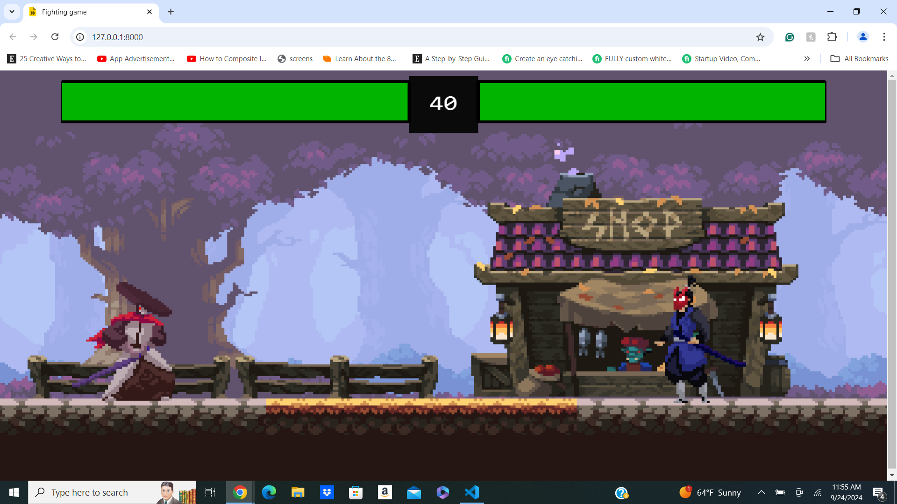

# Samurai-Fighters
samurai fighters is a game where you can play as a samurai and fight other samurai. It's made with kaboom.js.
# Screenshot

# Features
2D fighting game
Simple controls
Built with Kaboom.js and JavaScript
Endless gameplay
Getting Started
Prerequisites
Before you begin, ensure you have the following installed:

Node.js (v14 or higher)
Installation
Clone the repository:

bash
Copy code
npm install
Running the Game
Start the development server:

bash
Copy code
npm run dev
Open your browser and navigate to the provided localhost URL (typically http://localhost:8000).

Press the spacebar to start the game and control the bird.

# Controls
Player 1: Press the D to jump.
press the A for left movement.
press the D for right movement.
press the spacebar to Strike.
Player 2: Press the up arrow key to jump.
press the left arrow key for left movement.
press the right arrow key for right movement.
press the down arrow to Strike.
Press Enter to start the game.
Refresh the page if the players disappear.

# Built With
Kaboom.js - A game programming library that helps you make games fast and fun.
JavaScript

# Link
# https://siddz415.github.io/Samurai-Fighters/